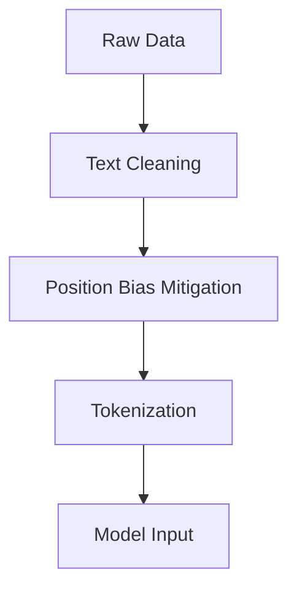

# LLM Preference Prediction - Kaggle Competition

[](https://www.kaggle.com/competitions/llm-classification-finetuning)
[](https://www.python.org/)
[](https://pytorch.org/)
[](https://huggingface.co/docs/transformers)

A solution for predicting human preferences between LLM-generated responses in head-to-head chatbot battles.

## 📌 Overview

This repository contains code for the Kaggle competition ["LLM Classification Finetuning"](https://www.kaggle.com/competitions/llm-classification-finetuning), where the goal is to predict which of two AI-generated responses humans will prefer. The solution uses fine-tuned transformer models to analyze conversational data from Chatbot Arena.

## 🚀 Key Features

- **Transformer-based Architecture**: Utilizes DeBERTa for sequence classification
- **Bias Mitigation**: Handles position bias through data augmentation
- **Efficient Training**: Mixed-precision training with Hugging Face `Trainer`
- **Probability Calibration**: Softmax with label smoothing
- **Reproducible**: Standardized preprocessing and training pipeline

## 📋 Requirements

```bash
Python 3.8+
pip install -r requirements.txt
```
## 🧠 Model Approach
### Data Processing Pipeline

### Architecture 
- Base Model: `microsoft/deberta-base`
- Classification Head: 3-class (A/B/Tie)
- Input Format:
    ```
    [CLS] Prompt: {text} [SEP] Response A: {text} [SEP] Response B: {text} [SEP]
    ```
- Training:
    - AdamW optimizer (lr=2e-5)
    - 3 epochs
    - FP16 mixed precision

## 📈 Performance
| Epoch | Train Loss | Val Loss | Accuracy
| --- | --- | --- | --- |
| 1 | 0.892 | 0.815 | 68.2% |
| 2 | 0.721 | 0.799 | 69.5% |
| 3 | 	0.634 | 0.812 | 69.1% |

## 🚧 Future Improvements
- Add cross-validation support
- Experiment with different base models (RoBERTa, GPT-Neo)
- Implement ensemble methods
- Add response length features
- Incorporate conversation history

## 📜 License
This project is released under the [Kaggle Competition Rules](https://www.kaggle.com/competitions/llm-classification-finetuning/rules). All code is MIT licensed unless otherwise specified.

## 🙏 Acknowledgments
- Kaggle team for hosting the competition
- Hugging Face for the Transformers library
- Microsoft Research for DeBERTa model

## 📬 Contact
For questions/suggestions, open an issue or contact [adityabussinesslimited@gmail.com]
